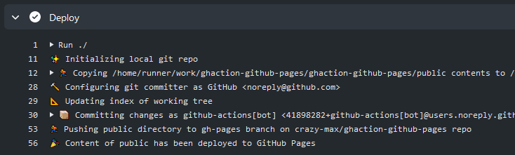

[](https://github.com/crazy-max/ghaction-github-pages/releases/latest)
[](https://github.com/marketplace/actions/github-pages)
[](https://github.com/crazy-max/ghaction-github-pages/actions?workflow=ci)
[](https://github.com/sponsors/crazy-max)
[](https://www.paypal.me/crazyws)

## About

A GitHub Action to deploy to GitHub Pages



___

* [Usage](#usage)
  * [Workflow](#workflow)
  * [Sign commits](#sign-commits)
  * [Check availability of GitHub Pages](#check-availability-of-github-pages)
* [Customizing](#customizing)
  * [inputs](#inputs)
  * [environment variables](#environment-variables)
* [Contributing](#contributing)
* [License](#license)

## Usage

### Workflow

Below is a simple snippet to deploy to GitHub Pages with a dummy HTML page.

A [workflow](https://github.com/crazy-max/ghaction-github-pages/actions?query=workflow%3Aci) is also available for
this repository and deploys [everyday to GitHub pages](https://crazy-max.github.io/ghaction-github-pages/).

```yaml
name: website

on: push

permissions: 
  contents: write

jobs:
  publish:
    runs-on: ubuntu-latest
    steps:
      -
        name: Checkout
        uses: actions/checkout@v3
      -
        name: Gen dummy page
        run: |
          mkdir public
          cat > public/index.html <<EOL
          <!doctype html>
          <html>
            <head>
              <title>GitHub Pages deployed!</title>
            </head>
            <body>
              <p>GitHub Pages with <strong>${{ github.sha }}</strong> commit ID has been deployed through <a href="https://github.com/marketplace/actions/github-pages">GitHub Pages action</a> successfully.</p>
            </body>
          </html>
          EOL
      -
        name: Deploy to GitHub Pages
        if: success()
        uses: crazy-max/ghaction-github-pages@v3
        with:
          target_branch: gh-pages
          build_dir: public
        env:
          GITHUB_TOKEN: ${{ secrets.GITHUB_TOKEN }}
```

### Sign commits

You can use the [Import GPG](https://github.com/crazy-max/ghaction-import-gpg) GitHub Action along with this one to
sign commits:

```yaml
      -
        name: Import GPG key
        uses: crazy-max/ghaction-import-gpg@v5
        with:
          gpg_private_key: ${{ secrets.GPG_PRIVATE_KEY }}
          passphrase: ${{ secrets.PASSPHRASE }}
          git_user_signingkey: true
          git_commit_gpgsign: true
      -
        name: Deploy to GitHub Pages
        if: success()
        uses: crazy-max/ghaction-github-pages@v3
        with:
          target_branch: gh-pages
          build_dir: public
        env:
          GITHUB_TOKEN: ${{ secrets.GITHUB_TOKEN }}
```

### Check availability of GitHub Pages

You can use the [GitHub Status](https://github.com/crazy-max/ghaction-github-status) Action along with this one to
check availability of GitHub Pages before deploying:

```yaml
      -
        name: Check GitHub Pages status
        uses: crazy-max/ghaction-github-status@v3
        with:
          pages_threshold: major_outage
      -
        name: Deploy to GitHub Pages
        if: success()
        uses: crazy-max/ghaction-github-pages@v3
        with:
          target_branch: gh-pages
          build_dir: public
        env:
          GITHUB_TOKEN: ${{ secrets.GITHUB_TOKEN }}
```

## Customizing

### inputs

Following inputs can be used as `step.with` keys

| Name                 | Type   | Description                                                                                                         |
|----------------------|--------|---------------------------------------------------------------------------------------------------------------------|
| `domain`             | String | Git domain (default `github.com`)                                                                                   |
| `repo`               | String | GitHub repository where assets will be deployed (default `$GITHUB_REPOSITORY`)                                      |
| `target_branch`      | String | Git branch where assets will be deployed (default `gh-pages`)                                                       |
| `keep_history`       | Bool   | Create incremental commit instead of doing push force (default `false`)                                             |
| `allow_empty_commit` | Bool   | Allow an empty commit to be created (default `true`)                                                                |
| `build_dir`          | String | Build directory to deploy (**required**)                                                                            |
| `absolute_build_dir` | Bool   | Whether to treat `build_dir` as an absolute path (defaults to `false`, making it relative to the working directory) |
| `follow_symlinks`    | Bool   | If enabled, the content of symbolic links will be copied (default `false`)                                          |
| `committer`          | String | Committer name and email address as `Display Name <joe@foo.bar>` (defaults to the GitHub Actions bot user)          |
| `author`             | String | Author name and email address as `Display Name <joe@foo.bar>` (defaults to the GitHub Actions bot user)             |
| `commit_message`     | String | Commit message (default `Deploy to GitHub pages`)                                                                   |
| `fqdn`               | String | Write the given domain name to the CNAME file                                                                       |
| `jekyll`             | Bool   | Allow Jekyll to build your site (default `true`)                                                                    |
| `dry_run`            | Bool   | If enabled, nothing will be pushed (default `false`)                                                                |
| `verbose`            | Bool   | Enable verbose output (default `false`)                                                                             |

### environment variables

Following environment variables can be used as `step.env` keys

| Name           | Description                                                                                                                                                  |
|----------------|--------------------------------------------------------------------------------------------------------------------------------------------------------------|
| `GITHUB_TOKEN` | [GITHUB_TOKEN](https://help.github.com/en/actions/configuring-and-managing-workflows/authenticating-with-the-github_token) as provided by `secrets`          |
| `GH_PAT`       | Use a [Personal Access Token](https://help.github.com/articles/creating-a-personal-access-token-for-the-command-line/) if you want to deploy to another repo |

## Contributing

Want to contribute? Awesome! The most basic way to show your support is to star the project, or to raise issues. If
you want to open a pull request, please read the [contributing guidelines](.github/CONTRIBUTING.md).

You can also support this project by [**becoming a sponsor on GitHub**](https://github.com/sponsors/crazy-max) or by
making a [Paypal donation](https://www.paypal.me/crazyws) to ensure this journey continues indefinitely!

Thanks again for your support, it is much appreciated! :pray:

## License

MIT. See `LICENSE` for more details.
